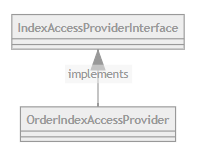

To access the an ES index the official PHP low-level [client](https://github.com/elastic/elasticsearch-php/blob/master/src/Elasticsearch/Client.php) for Elasticsearch is used. The _Client_ is retrieved from the _ClientBuilder_: 

```php
$esClient = ClientBuilder::create()->build();
```
The client can then execute querys with different methods (i.e. create, count, delete, get,...). What such queries can look like is already documented [here](home/How to create an Elasticsearch order index in Kibana). Below is short sample code to show how to retrieve a document with id _$someId_ from index _index_name_. The name of the Order Index is _``order_segments``_.

```php
$params = [
   'index' => 'index_name',
   'type' => '_doc',
   'id' => $someId
];

$response = $esClient->get($params);
```

Another example is the creation of documents. _$entry_ contains the data that should be stored.
```php
$params = [
   'index' => 'index_name',
   'type' => '_doc',
   'id' => $someId,
   'body' => $entry
];

$esClient->index($params);
```

A complete example with the creation of the _ClientBuilder_ is the _OrderIndexAccessProvider_ shown below.

## Architecture



### IndexAccessProviderInterface
The interface provides access to a data storage which contains segments for a certain id. In general, this interface is designed to work with different indices as well as different databases. It features a method to store data which takes a documentId and a body. The documentId is needed to distinguish the data sets (body) added. The body contains the data to be stored. What this data looks like depends on the actual implementation of the interface.

```php
interface IndexAccessProviderInterface
{
    public function fetchSegments(int $id): array;
    public function index(int $documentId, $body);
}
```

### OrderIndexAccessProvider
The _OrderIndexAccessProvider_ implements the _IndexAccessProviderInterface_ and stores data needed by the Purchase-History-based Adapter. The data structure of the body is defined [here](home/How to create an Elasticsearch order index in Kibana). It contains code to access the ES order index.

The _esClient_ is created and used to access an index as explained above.

```php
class OrderIndexAccessProvider implements IndexAccessProviderInterface
{
    private $esClient;

    private static $indexName = 'order_segments';

    public function __construct()
    {
        $this->esClient = ClientBuilder::create()->build();
    }

    /**
     * Returns all purchase history segments of a customer
     * @param int $customerId Customer id / user id
     * @return array Segment array
     */
    public function fetchSegments(int $customerId): array
    {
        $params = [
            'index' => self::$indexName,
            'type' => '_doc',
            'id' => $customerId
        ];

        $response = $this->esClient->get($params);
        return $response['_source']['segments'];
    }

    public function index(int $documentId, array $body)
    {
        // TODO: Implement index() method.
    }
}
```

