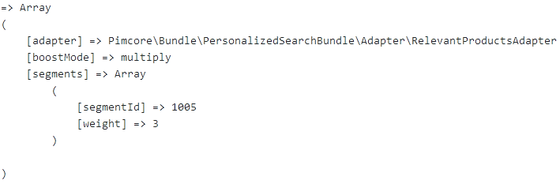

# Adapter implementation details

An *adapter* is responsible for personalizing an *Elasticsearch query*.

Three different implementations are provided:
* *SegmentAdapter*: Adds personalization to resemble the users search behaviour. Products in the search query are weighted based on the users visit count. Every user is assigned segments which resemble products, categories or even groups.
* *PurchaseHistoryAdapter*: Adds personalization to order products by the customers buying behaviour. Therefore we need segments based on all orders a customer made. Currently this adapter simply weights products containing segments based on the extracted segments from the orders.
* *RelevantProductsAdapter*: Adds personalization based on a certain customer group the customer is assigned. Each customer group contains segments. Searched products are ordered based on the segments in the corresponding customer group.

Every adapter takes an array which represents the Elasticsearch query. The query is wrapped into a `function_score` of Elasticsearch.

This is what the query looks like if two adapters are executed:

```php
Array
(
    [multi_match] => Array
        (
            [query] => red
            [type] => cross_fields
            [operator] => and
            [fields] => Array
                (
                    [0] => attributes.name^4
                    [1] => attributes.name.analyzed
                    [2] => attributes.name.analyzed_ngram
                    [3] => attributes.manufacturer_name^3
                    [4] => attributes.manufacturer_name.analyzed
                    [5] => attributes.manufacturer_name.analyzed_ngram
                    [6] => attributes.color
                    [7] => attributes.carClass
                )
        )
)

Array
(
    [function_score] => Array
        (
            [query] => Array
                (
                    [function_score] => Array
                        (
                            [query] => Array
                                (
                                    [multi_match] => Array
                                        (
                                            [query] => red
                                            [type] => cross_fields
                                            [operator] => and
                                            [fields] => Array
                                                (
                                                    [0] => attributes.name^4
                                                    [1] => attributes.name.analyzed
                                                    [2] => attributes.name.analyzed_ngram
                                                    [3] => attributes.manufacturer_name^3
                                                    [4] => attributes.manufacturer_name.analyzed
                                                    [5] => attributes.manufacturer_name.analyzed_ngram
                                                    [6] => attributes.color
                                                    [7] => attributes.carClass
                                                )
                                        )
                                )
                            [functions] => Array
                                (
                                    [0] => Array
                                        (
                                            [filter] => Array
                                                (
                                                    [match] => Array
                                                        (
                                                            [relations.segments] => 988
                                                        )
                                                )
                                            [weight] => 40
                                        )
                                    [1] => Array
                                        (
                                            [filter] => Array
                                                (
                                                    [match] => Array
                                                        (
                                                            [relations.segments] => 989
                                                        )
                                                )
                                            [weight] => 32
                                        )
                                    [2] => Array
                                        (
                                            [filter] => Array
                                                (
                                                    [match] => Array
                                                        (
                                                            [relations.segments] => 1005
                                                        )
                                                )
                                            [weight] => 24
                                        )
                                )
                            [boost_mode] => multiply
                        )
                )
            [functions] => Array
                (
                    [0] => Array
                        (
                            [filter] => Array
                                (
                                    [match] => Array
                                        (
                                            [relations.segments] => 983
                                        )
                                )
                            [weight] => 8
                        )
                    [1] => Array
                        (
                            [filter] => Array
                                (
                                    [match] => Array
                                        (
                                            [relations.segments] => 963
                                        )
                                )
                            [weight] => 8
                        )
                    [2] => Array
                        (
                            [filter] => Array
                                (
                                    [match] => Array
                                        (
                                            [relations.segments] => 982
                                        )
                                )
                            [weight] => 8
                        )
                    [3] => Array
                        (
                            [filter] => Array
                                (
                                    [match] => Array
                                        (
                                            [relations.segments] => 971
                                        )
                                )
                            [weight] => 8
                        )
                    [4] => Array
                        (
                            [filter] => Array
                                (
                                    [match] => Array
                                        (
                                            [relations.segments] => 970
                                        )
                                )
                            [weight] => 8
                        )
                )
            [boost_mode] => multiply
        )
)
```

## Adapter interface
The `AdapterInterface` defines two methods:
* `addPersonalization()`: Augments the query with the corresponding personalization code.
* `getDebugInfo()`: Returns information based on the current personalization. Our predefined adapters return the following data structure when calling `getDebugInfo()`: 

```php
interface AdapterInterface
{
    public function addPersonalization(array $query, float $weight = 1.0, string $boostMode = "multiply"): array;
    public function getDebugInfo(float $weight = 1.0, string $boostMode = "multiply"): array;
}
```

## AbstractAdapter
For common functionality the class `AbstractAdapter` was defined. Since we currently have no functionality which is shared between all adapters this class is currently empty.

```php
abstract class AbstractAdapter implements AdapterInterface
{
}
```

## SegmentAdapter
The segment adapter uses:

```php
use CustomerManagementFrameworkBundle\Targeting\SegmentTracker;
use Pimcore\Targeting\VisitorInfoStorage;
```

to query all assigned segments of the current visitor.
This segments represent the browsing behaviour of the user on the web shop.
Having this information we can boost our query and therfore order products which the user is more interested in at the beginning.

To show how our adapter concept works we first create a class which extends `AbstractAdapter`.
In our case the following implementation reflects the contained `SegmentAdapter`. In the constructor we inject the necessary services which are used so that we can query user segments and augment the query.

Next we need to implement the methods `addPersonalization()` and `getDebugInfo()` which are defined in the `AdapterInterface`.

Since we need to query all segments from the current site visitor we first use the `VisitorInfoStorage` class to get information about the current visitor. Using the `SegmentTracker` we can now read the assigned segments of the current visitor. This information is internally extracted from the cookie.

The function `addPersonalization()` takes the `query` and optional a `weighting` and a `boostMode`. The query is an array data structure which represents the Elasticsearch query. This query is wrapped in a `function_score` and uses every segment to generate functions for boosting products. For further information about boosting a query please visit the [Elasticsearch documentation](https://www.elastic.co/guide/en/elasticsearch/reference/current/query-dsl-function-score-query.html). At last we return the modified query.

The function `getDebugInfo()` is for debugging purposes and yields information about all segments used during the personalization process for this adapter.

```php
class SegmentAdapter extends AbstractAdapter
{
    /**
     * @var VisitorInfoStorage
     */
    private $visitorInfoStorage;

    /**
     * @var SegmentTracker
     */
    private $segmentTracker;

    /**
     * SegmentAdapter constructor.
     * @param VisitorInfoStorage $visitorInfoStorage
     * @param SegmentTracker $segmentTracker
     */
    function __construct(VisitorInfoStorage $visitorInfoStorage, SegmentTracker $segmentTracker) {
        $this->visitorInfoStorage = $visitorInfoStorage;
        $this->segmentTracker = $segmentTracker;
    }

    /**
     * Adds boosting based on user segments
     * @param array $query
     * @param float $weight
     * @param string $boostMode
     * @return array
     */
    public function addPersonalization(array $query, float $weight = 1.0, string $boostMode = "multiply"): array
    {
        $functions = [];

        $segments = $this->segmentTracker->getAssignments($this->visitorInfoStorage->getVisitorInfo());
        foreach ($segments as $segmentId => $count) {
            $functions[] = [
                'filter' => ['match' => ['relations.segments' => $segmentId]],
                'weight' => $count * $weight
            ];
        }

        $segmentQuery = [
            'function_score' => [
                'query' => $query,
                'functions' => $functions,
                'boost_mode' => $boostMode
            ]
        ];

        return $segmentQuery;
    }

    /**
     * Get boosting values
     * @param float $weight
     * @param string $boostMode
     * @return array
     */
    public function getDebugInfo(float $weight = 1.0, string $boostMode = "multiply"): array
    {
        $info = [
            'adapter' => get_class($this),
            'boostMode' => $boostMode,
            'segments' => []
        ];

        $segments = $this->segmentTracker->getAssignments($this->visitorInfoStorage->getVisitorInfo());
        foreach ($segments as $segmentId => $count) {
            $info['segments'] = [
                'segmentId' => $segmentId,
                'weight' => $count * $weight
            ];
        }

        return $info;
    }
}
```

## PurchaseHistoryAdapter
The purchase history adapter uses:

```php
use Pimcore\Bundle\PersonalizedSearchBundle\Customer\PersonalizationAdapterCustomerIdProvider;
use Pimcore\Bundle\PersonalizedSearchBundle\IndexAccessProvider\OrderIndexAccessProvider;
```

An implementation of the `PersonalizationAdapterCustomerIdProvider` defines how to fetch the customer id of the logged in user. After that all segments of the user are fetched from the order index in Elasticsearch using the `OrderIndexAccessProvider`.

One Elasticsearch index (`order_segments`) is necessary to fetch the users segments.

### OrderSegmentsIndex data structure - Document for customer order segments
For each customer a document exists which contains all segments extracted from their orders.
The `segmentCount` property defines the weighting of a certain segment, for example when the user buys multiple products of the same brand.
```json
{
  "_index": "order_segments",
  "_type": "_doc",
  "_id": "1018",
  "_version": 1,
  "_score": 1,
  "source": {
    "customerId": 1018,
    "segments": [
      {
        "segmentId": 930,
        "segmentCount": 1
      },
      {
        "segmentId": 931,
        "segmentCount": 2
      }
    ]
  }
}
```

## RelevantProductsAdapter
The relevant products adapter uses:

```php
use Pimcore\Bundle\PersonalizedSearchBundle\Customer\PersonalizationAdapterCustomerIdProvider as CustomerIdProvider;
use Pimcore\Bundle\PersonalizedSearchBundle\IndexAccessProvider\CustomerGroupIndexAccessProviderInterface;
```

An implementation of the `PersonalizationAdapterCustomerIdProvider` defines how to fetch the customer id of the logged in user. After that all segments of the user are fetched from the corresponding indices in Elasticsearch using the `CustomerGroupIndexAccessProviderInterface`.

Two elastic search indices are necessary. One for assigning a Customer to a Customer Group (`customergroup`) and one for assigning all Customer Groups to Segments (`customergroup_segments`).

### CustomerGroupIndex data structure - Customer assigned to customer group
The first index represents the assigment of every customer to a customer group.

```json
{
  "_index": "customergroup",
  "_type": "_doc",
  "_id": "1018",
  "_version": 1,
  "_score": 1,
  "_source": {
    "customerId": 1018,
    "customerGroupId": 1
  }
}
```

### CustomerGroupSegementsIndex data structure - Customer groups containing segments
The second index stores the segments for each customer group. The indices are connected through the `customerGroupId`.

```json
{
  "_index": "customergroup_segments",
  "_type": "_doc",
  "_id": "1",
  "_version": 1,
  "_score": 1,
  "_source": {
    "customerGroupId": 1,
    "segments": [
      {
        "segmentId": 963,
        "segmentCount": 5
      },
      {
        "segmentId": 985,
        "segmentCount": 4
      },
      {
        "segmentId": 991,
        "segmentCount": 3
      },
      {
        "segmentId": 999,
        "segmentCount": 2
      }
    ]
  }
}
```
