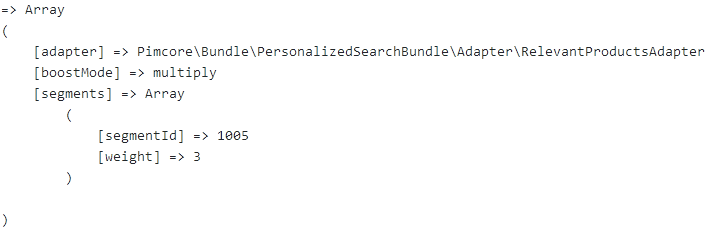

# Adapter implementation details

An *adapter* is responsible for personalizing an *Elasticsearch query*.

Three different implementations are provided:
* *SegmentAdapter*: Adds personalization to resemble the users search behaviour. Products in the search query are weighted based on the users visit count. Every user is assigned segments which resemble products, categories or even groups.
* *PurchaseHistoryAdapter*: Adds personalization to order products by the customers buying behaviour. Therefore we need segments based on all orders a customer made. Currently this adapter simply weights products containing segments based on the extracted segments from the orders.
* *RelevantProductsAdapter*: Adds personalization based on a certain customer group the customer is assigned. Each customer group contains segments. Searched products are ordered based on the segments in the corresponding customer group.

Every adapter takes an array which represents the Elasticsearch query. This query is wrapped 

This is what the query looks like if two adapters are executed:

```php
Array
(
    [multi_match] => Array
        (
            [query] => red
            [type] => cross_fields
            [operator] => and
            [fields] => Array
                (
                    [0] => attributes.name^4
                    [1] => attributes.name.analyzed
                    [2] => attributes.name.analyzed_ngram
                    [3] => attributes.manufacturer_name^3
                    [4] => attributes.manufacturer_name.analyzed
                    [5] => attributes.manufacturer_name.analyzed_ngram
                    [6] => attributes.color
                    [7] => attributes.carClass
                )
        )
)

Array
(
    [function_score] => Array
        (
            [query] => Array
                (
                    [function_score] => Array
                        (
                            [query] => Array
                                (
                                    [multi_match] => Array
                                        (
                                            [query] => red
                                            [type] => cross_fields
                                            [operator] => and
                                            [fields] => Array
                                                (
                                                    [0] => attributes.name^4
                                                    [1] => attributes.name.analyzed
                                                    [2] => attributes.name.analyzed_ngram
                                                    [3] => attributes.manufacturer_name^3
                                                    [4] => attributes.manufacturer_name.analyzed
                                                    [5] => attributes.manufacturer_name.analyzed_ngram
                                                    [6] => attributes.color
                                                    [7] => attributes.carClass
                                                )
                                        )
                                )
                            [functions] => Array
                                (
                                    [0] => Array
                                        (
                                            [filter] => Array
                                                (
                                                    [match] => Array
                                                        (
                                                            [relations.segments] => 988
                                                        )
                                                )
                                            [weight] => 40
                                        )
                                    [1] => Array
                                        (
                                            [filter] => Array
                                                (
                                                    [match] => Array
                                                        (
                                                            [relations.segments] => 989
                                                        )
                                                )
                                            [weight] => 32
                                        )
                                    [2] => Array
                                        (
                                            [filter] => Array
                                                (
                                                    [match] => Array
                                                        (
                                                            [relations.segments] => 1005
                                                        )
                                                )
                                            [weight] => 24
                                        )
                                )
                            [boost_mode] => multiply
                        )
                )
            [functions] => Array
                (
                    [0] => Array
                        (
                            [filter] => Array
                                (
                                    [match] => Array
                                        (
                                            [relations.segments] => 983
                                        )
                                )
                            [weight] => 8
                        )
                    [1] => Array
                        (
                            [filter] => Array
                                (
                                    [match] => Array
                                        (
                                            [relations.segments] => 963
                                        )
                                )
                            [weight] => 8
                        )
                    [2] => Array
                        (
                            [filter] => Array
                                (
                                    [match] => Array
                                        (
                                            [relations.segments] => 982
                                        )
                                )
                            [weight] => 8
                        )
                    [3] => Array
                        (
                            [filter] => Array
                                (
                                    [match] => Array
                                        (
                                            [relations.segments] => 971
                                        )
                                )
                            [weight] => 8
                        )
                    [4] => Array
                        (
                            [filter] => Array
                                (
                                    [match] => Array
                                        (
                                            [relations.segments] => 970
                                        )
                                )
                            [weight] => 8
                        )
                )
            [boost_mode] => multiply
        )
)
```

## Adapter interface
The `AdapterInterface` defines two methods:
* `addPersonalization()`: Augments the query with the corresponding personalization code.
* `getDebugInfo()`: Returns information based on the current personalization. Our predefined adapters return the following data structure when calling `getDebugInfo()`: 

```php
interface AdapterInterface
{
    public function addPersonalization(array $query, float $weight = 1.0, string $boostMode = "multiply"): array;
    public function getDebugInfo(float $weight = 1.0, string $boostMode = "multiply"): array;
}
```

## AbstractAdapter
For common functionality the class `AbstractAdapter` was defined. Since we currently have no functionality which is shared between all adapters this class is currently empty.

```php
abstract class AbstractAdapter implements AdapterInterface
{
}
```

## SegmentAdapter
The segment adapter uses:

```php
use CustomerManagementFrameworkBundle\Targeting\SegmentTracker;
use Pimcore\Targeting\VisitorInfoStorage;
```

to query all assigned segments of the current visitor. This segments represent the browsing behaviour of the user on the web shop.
Having this information we can boost our query and therfore order products which the user is more interested in at the beginning.

## PurchaseHistoryAdapter

```php

```

## RelevantProductsAdapter

```php


```
