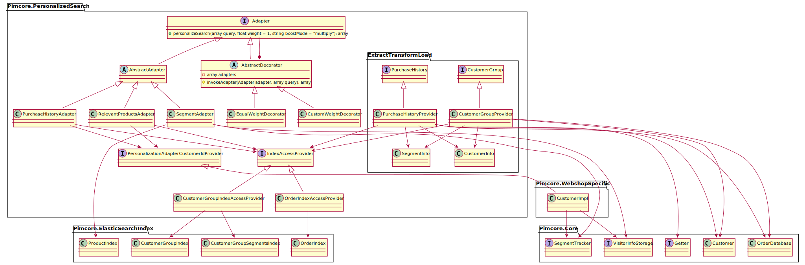

# Architecture

## General architecture

### Decorator and Adapter
The adapters are to be used either individually or together. Decorator-Pattern is used to decorate the search action in `ProductController` with the additional functionality of our adapters. All adapters implement `addPersonalization` method and return the query with personalization added. With `addAdapter` you first add all adapters that you want to use to the Decorator and then call `addPersonalization` method of the Decorator, where `addPersonalization` method of each adapter is called.

### Adapter in Detail
There are three different types of adapters in this extension:

1. SegmentAdapter
2. PurchaseHistoryAdapter
3. RelevantProductAdapter

The following decorators are available in addition to these adapters:

1. EqualWeightDecorator
2. PerformanceMessurementDecorator

The segment-based adapter has the following functionality: The user clicks on different products. This behavior is recorded in the form of segments by Pimcore. These are weighted by the segment-based adapter for search queries and then transmitted to the user.

The purchase-history adapter on the other hand is based on the customer's purchase history. That means every product has segments. If the customer buys products, the segments of these products are of course also included in the order. This information is used in this adapter to make the order of the search. Attention, this adapter therefore only works with a logged in user.

The relevant product adapter is a similar customer buy the following product adapters. This means that customers are assigned to customer groups and behind customer groups are segments. This means that a user must be logged on to use this adapter if the articles that belong to his customer group are prioritized in the search.

### ETL-Mechanism
The ETL-Mechanism creates the following three ElasticSearch-Indices via `IndexAccessProvider`:
1. `OrderIndex`: Contains CustomerId with associated segmentId and segmentCount depending on placed orders
2. `CustomerGroupIndex`: Contains CustomerId with associated CustomerGroupId
3. `CustomerGroupSegmentsIndex`: Contains CusomterGroupId with associated segmentId and segmentCount
And all three adapteres access these indices also via `IndexAddProvider`.

## Adapt Architecture Diagram
For creating the diagram PlantUML has been used. Under macOS this can be installed with `brew install plantuml`. This extension is executed with `plantuml <file.txt> -tsvg` The `-tsvg` extension is used to generate SVG files instead of PNG. To use the correct structure of the `.txt` files go to the [official documentation](https://plantuml.com).