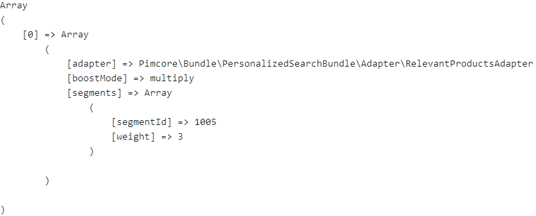

# Decorator implementation details

A *decorator* is responsible for executing multiple adapters at once and can influence the weighting of each adapter.

In our bundle one decorator is predefined called *EqualWeightDecorator*. This decorator weights all adapters the same.

## AbstractDecorator
Since our decorator should be used like an adapter every decorator implements the `AdapterInterface. 

`AbstractDecorator` implements `AdapterInterface` and defines the basic functionality of each decorator. Internally added adapters are stored in an array. Since the method `addAdapter()` returns our decorator this methods are chainable.

Since every decorator implements `AdapterInterface` our abstract class `AbstractDecorator` defines the two methods `addPersonalization()` and `getDebugInfo()`.

`addPersonalization()` executes each adapter to add every adapters personalization to the Elasticsearch query.

`getDebugInfo()` collects segment information of the current personalization from each adapter and returns them.
Calling this method on our predefined decorator returns the following data structure containing an array of adapter segment information:



At last an abstract method `invokeAdapter()` exists which has to be overwritten by a concrete class. This method defines what happens if an adapter gets invoked.

```php
abstract class AbstractDecorator implements AdapterInterface
{
    private $adapters;

    public function __construct(array $adapters = array())
    {
        $this->adapters = $adapters;
    }

    public function addAdapter(AdapterInterface $adapter): AbstractDecorator
    {
        $this->adapters[] = $adapter;
        return $this;
    }

    public function addPersonalization(array $query, float $weight = 1.0, string $boostMode = "multiply"): array
    {
        foreach ($this->adapters as $adapter) {
            $query = $this->invokeAdapter($adapter, $query);
        }
        return $query;
    }

    public function getDebugInfo(float $weight = 1.0, string $boostMode = "multiply"): array
    {
        $res = [];

        foreach ($this->adapters as $adapter) {
            $res[] = $adapter->getDebugInfo($weight, $boostMode);
        }
        return $res;
    }

    abstract protected function invokeAdapter(AdapterInterface $adapter, array $query): array;
}
```

## EqualWeightDecorator
`EqualWeightDecorator` is a class provided by our bundle. This decorator weights all adapters equally.

Therefore we only need to specify the abstract method `invokeAdapter` where we call the `addPersonalization` method of one adapter which is provided by the first argument.

```php
class EqualWeightDecorator extends AbstractDecorator
{
    protected function invokeAdapter(AdapterInterface $adapter, array $query): array
    {
        return $adapter->addPersonalization($query);
    }
}
```

## PerformanceMeasurementDecorator
The *PerformanceMeasurementDecorator* simply measures time it takes for an adapter to execute the *addPersonalization* method. The resulting information is then stored in an Elasticsearch index. However, this index is not created automatically and must be created manually as shown below.

### Adapter implementation
Since we extend from AbstractDecorator which defines the abstract method invokeAdapter we can intercept the adapter calls:
```php
protected function invokeAdapter(AdapterInterface $adapter, array $query): array
    {
        $start = microtime(true);
        $res = $adapter->addPersonalization($query);
        $elapsedTimeInSeconds = microtime(true) - $start;

        $performanceInfo = new PerformanceInfo(get_class($adapter), $elapsedTimeInSeconds * 1000);
        $this->adapterPerformanceIndex->index(0, $performanceInfo);

        return $res;
    }
```

### Create the index
```
PUT adapter_performance 
{
  "mappings": {
    "_doc": {
      "properties": {
        "adapterName" : {
          "type" : "text",
          "fields" : {
            "keyword" : {
              "type" : "keyword",
              "ignore_above" : 256
            }
          }
        },
        "elapsedTime" : {
          "type" : "float"
        },
        "timestamp" : {
          "type" : "date",
          "format": "yyyy-MM-dd HH:mm:ss"
        }
      }
    }
  }
}
```

### Data structure
An entry looks as follows in Elasticsearch:
```
{
  "_index": "adapter_performance",
  "_type": "_doc",
  "_id": "0ILCeXIB5LbQlYFX_xlX",
  "_version": 1,
  "_score": 1,
  "_source": {
    "adapterName": "Pimcore\\Bundle\\PersonalizedSearchBundle\\Adapter\\RelevantProductsAdapter",
    "elapsedTime": 3.924131393432617,
    "timestamp": "2020-06-03 12:38:42"
  },
  "fields": {
    "timestamp": [
      "2020-06-03T12:38:42.000Z"
    ]
  }
}
```

The gathered data can be used for analysations directly in Kibana. An example of a visualization of the overall adapter performances (min, max, average) is shown below:
[ExampleAdapterComparison](./img/example_adapter_comparison.png)

### Usage
```
$personalizationDecorator = new PerformanceMeasurementDecorator(new AdapterPerformanceIndexAccessProvider());
```
