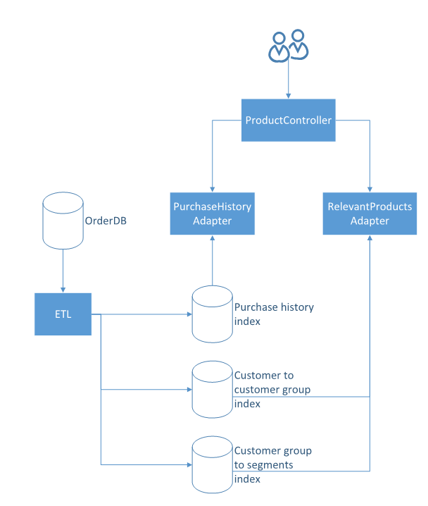

# ETL mechanism

The ETL mechanism is responsible for providing the necessary data in the ES indices to ensure correct search results when using the concrete adapters.

## The ElasticSearch indices

The PurchaseHistoryAdapter uses the PurchaseHistoryIndex to store, which products a user has bought how many times.

The RelevantProductsAdapter uses two indices, one to store to which customer group a customer belongs and a second one, that stores the segments of the products commonly purchased by users in a particular group.

The interplay of the adapters and the decorators is illustrated in the image below.



## ETL mechanism for the purchase history adapter

By using the following interface, either the purchase information of all customers or only specific ones can be extracted from the Order Database in order to fill the ES index.

```php
interface PurchaseHistoryInterface
{
    public function fillOrderIndex(CustomerInfo $customerInfo);
    public function updateOrderIndexFromOrderDb();
    public function getPurchaseHistory(int $customerId): CustomerInfo;
}
```

In detail, the segments of a customer's purchased products will be saved into the index. For this, all orders of the customer are be loaded from the database, then the `GetterInterface` is used, to get the segments of all the ordered products.
These segments and how often the product has been ordered are then saved into the ElasticSearch index.

## ETL mechanism for the relevant products adapter

As for purchase history ETL there also exists an interface for the relevant products ETL:

```php
interface CustomerGroupInterface
{
    public function updateCustomerGroupAndSegmentsIndicesFromOrderDb();
}
```

Yet, there is only the possibility to update the assignments for all customers at once. The goal of the relevant products ETL is to assign customers with similar purchase behavior to the same group. There exist two ES indices, one for the group assignment for each customer and one for the groups itself, which contains the similar segments of all customers in this group.

Our implementation will assign every customer, who has purchased at least 1 product with segments, to a group. A customer will be assigned to an existing group, if the intersection of their segments exceeds a certain threshold.

This threshold can be set in the class `CustomerGroupProvider`. This class asigns customers to a group. For each customer, we check, if there is a group that matches this customer's segments. If this is the case, the customer is assigned to this existing group. Otherwise, a new group is created, to which the customer is then assigned.

```php
$customerInfo = self::getPurchaseHistory($customerId);

$customerInfoSegmentIds = array_map(function ($entry) {
    return $entry->segmentId;
}, $customerInfo->segments);

$allCustomerGroups = $this->customerGroupIndexAccessProvider->fetchCustomerGroups();
$isAssigned = false;

foreach ($allCustomerGroups as $customerGroup) {
    $customerGroupSegmentIds = array_map(function ($entry) {
        return $entry->segmentId;
    }, $customerGroup->segments);

    $intersection = array_intersect($customerInfoSegmentIds, $customerGroupSegmentIds);

    if (sizeof($customerInfoSegmentIds) > 0 && sizeof($customerGroupSegmentIds) > 0) {

        $customerInfoMatchPercentage = sizeof($intersection) / sizeof($customerInfoSegmentIds);
        $customerGroupMatchPercentage = sizeof($intersection) / sizeof($customerGroupSegmentIds);

        if ($customerInfoMatchPercentage > self::PROCENTUAL_INTERSECTION
            && $customerGroupMatchPercentage > self::PROCENTUAL_INTERSECTION)
        {
            $customerGroupAssignment = new CustomerGroupAssignment($customerId, $customerGroup);
            $this->customerGroupIndexAccessProvider->indexCustomerGroupAssignment($customerGroupAssignment);

            $isAssigned = true;
        }
    }
}

if (!$isAssigned && sizeof($customerInfoSegmentIds) > 0) {
    $newId = 1;
    if(sizeof($allCustomerGroups) > 0) {
        $newId = max(array_map(function ($customerGroups) {
                return $customerGroups->customerGroupId;
            }, $allCustomerGroups)) + 1;
    }

    $customerGroupAssignment = new CustomerGroupAssignment($customerId, new CustomerGroup($newId, $customerInfo->segments));
    $this->customerGroupIndexAccessProvider->indexCustomerGroupAssignment($customerGroupAssignment);
}
```

### Possible enhancements

Our implemented strategy to creating the customer groups and assigning the customers is very basic, and not good at for example adjusting a group to newly assigned customers. Therefore, as a more enhanced version, a clustering algorithm could be implemented, which finds the suiting customer groups and assignments more effectively.


## Using the ETL mechanism programatically, via commands and via cron jobs
In this section will be described, how to use the ETL mechanism in its different ways.

### Programatically
To invoke the ETL programatically, the interfaces `PurchaseHistoryInterface` and `CustomerGroupInterface` can be used to fill the ES indices. Both interfaces can be injected through the Dependency Injection Container, the concrete implementation which is used is stated in the services.yml, but at this point there exists only one implementation for each interface.

### Command
To run the ETL mechanism from the console, navigate to the folder containing the console

 `/home/pimcoredemo/www` 
 
 and enter the following command:
 
 `./bin/console personalizedsearch:start-etl`.

To explicitly only run the ETL for the **purchase history**, an argument can be provided like that:

`./bin/console personalizedsearch:start-etl PurchaseHistory`

and for the **customer assignment** to its group:

`./bin/console personalizedsearch:start-etl CustomerGroup`


### Cron job

To run the command at an specified interval, you can create a cron job. To do so, open the crontab with `crontab -e` and create a new line in this file.
To run the command every hour, create the following entry:

`* */1 * * * /home/pimcoredemo/www/bin/console personalizedsearch:start-etl >> /tmp/personalizedsearch-etl.log`.