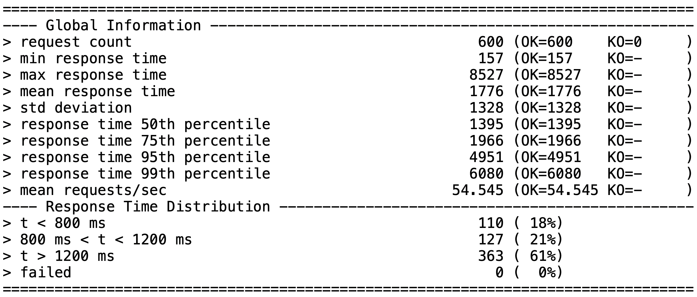
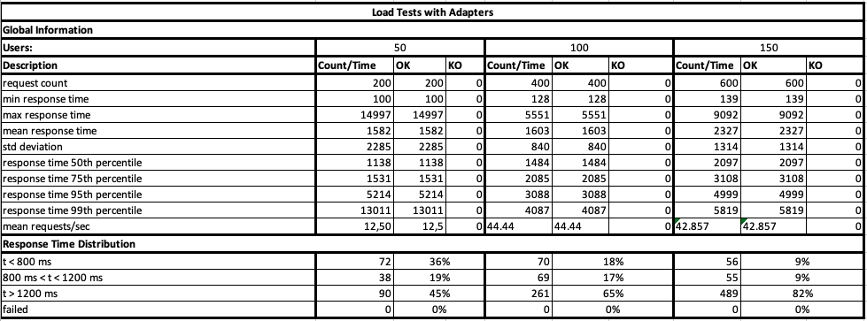
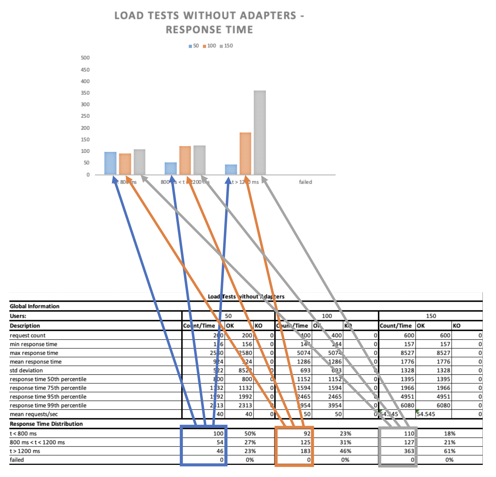

# Load Testing 

## Gatling

The decision had to be made between [JMeter](https://jmeter.apache.org/) and [Gatling](https://gatling.io/). We decided to use Gatling because it is the more modern tool and it is simpler in usage. Currently we are just using the Open Source Version of Gatling, but it is as well possible to use the Enterprise Version for visualizing the results.

### Setup for Windows

1. Download Open Source Version [here](https://gatling.io/open-source)
2. Unzip folder
3. Set environment variable `GATLING_HOME`
4. Open Gatling Recorder (tool that generates scala script) with `%GATLING_HOME%\bin\recorder.bat`
5. Open chrome browser and start recording: Developer Tools -> Network -> Enable Preserve Log -> Clear (check that log is empty)
6. Click through the test case in the Chrome browser
7. Create HAR file in chrome browser: Developer Tools -> Network -> Right Click -> Save all as HAR with content

8. In Gatling Recorder: Select Recorder Mode HAR File -> Insert path to HAR file -> Click `Start` -> Scala script will be generated in `/user-files/simulations`
9. Clean up Scala script: Delete all requests that are not necessary (only 3 requests are neccessary: switching the tenant, logging in, and making the search request) and adapt number of multiple users at once in the last line at `scn.inject(atOnceUsers(10))`
10. Execute `cd %GATLING_HOME%\bin` and then `powershell "gatling.bat | tee output.txt"` -> Select your scala script in cmd -> Press Enter -> Result printed to cmd and in file `output.txt`

### Tests

Tests executed on [Staging Server](https://studienprojekt2020.elements.live/) and local Browser.

Test case: 
1. Login as bamm@modern.age
2. Tenant Switch to Elastic Search Tenant
3. Search with Search Term 'beige'
   
4 Requests are executed for each user, and the test has been executed for 50, 100 and 150 users, so 200, 400 and 600 requests are made.

Used Scala Script for Tests: [beige.scala](./assets/loadTest/beige.scala)

## Results
All results in detail can be found in following Excel file [LoadTest.xlsx](./assets/loadTest/LoadTest.xlsx). In the first step the results are gathered with gatling by execution described in the section above. By executing these commands you get the following results gathered in one txt file:

With these files the tables in the Excel file are filled. The tables in general are showing which impact the usage of our adapters has on the runtime, compared to the runtime with no adapters used:

The following image describes how the diagrams are generated from the gathered staticts:

The load tests are performed locally on our development machines. The environment is hosted on a pimcore server. We executed the load test with 50, 100 and 150 synchronous connections. We tested this scenario with all adapters, with every single adapter and with no adapter. The conclusio is that our adapters have an impact on the response time. This means in numbers 126 requests out of 600 have a higher time consumption than without the adapters. The reason for higher response times are the request on the elastic search index which have a warm up time and can be imporved in next sprints.

### Point when load on the system gets critical

It was not possible to reach the point where load tests get critical. The problem is the Internet speed of our home internet connections, because it is not possible to have more than round about 20 users at the same time.

### Graph illustrating the time required for the search over the number of simultaneous requests and time

Every simulation has two visualizations. The first one shows the On the first diagram the x axis is divided into 3 ranges for the response times: <800ms, 800ms-1200ms, >1200ms and failed. The second one shows response time with growing percentile.

#### Simulations without adapters

#### Simulations with all adapters

##### Only with Segment based adapter

##### Only with Purchase History adapter

##### Only with Relevant Product adapter

